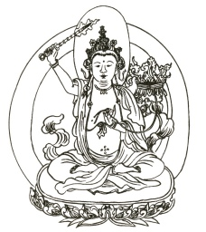

# The Gateless Gate
_by Ekai (Mu-mon), tr. Nyogen Senzaki and Paul Reps (1934)_

This classic Zen Buddhist collection of 49 koans with commentary by Mumon
was originally published in 1934, and later included in Paul Reps and
Nyogen Senzaki's popular anthology _Zen Flesh, Zen Bones_. Due to non-renewal
it is currently in the public domain in the US (although other parts of _Zen Flesh, Zen Bones_ are not).

Koans are a Zen Buddhist spiritual technique which use word-play to achieve enlightenment.
They frequently involve absurd or contradictory statements, which are intended
to create extreme cognitive dissonance in the mind of the pupil. As such,
their actual content or structure is not as important as the mental state which
they induce. This collection includes some of the most famous koans, such as
[Tozan's "three pounds of flax"](./18_tozans_three_pounds.md):

> What is the Buddha?
>
> This flax weighs three pounds.

and Baso's conundrum:

> What is Buddha?
>
> This mind is not Buddha.

as well as some involving bizarre behavior, such as
[Nansen Cuts the Cat in Two](./14_nansen_cuts_the_cat_in_two.md)
and
[Blow out the Candle](./28_blow_out_the_candle.md).

While short and succinct, this book has enormous depth, and offers new rewards on repeated readings.
